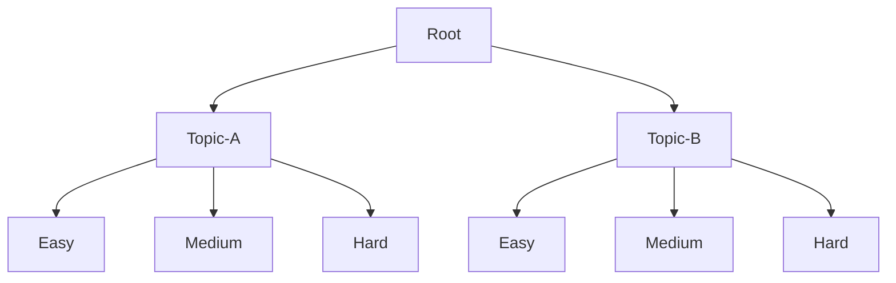

# DSA - Data Structures and Algorithms

## 📖 About This Project

**DSA** is a collection of Java solutions to common data structure and algorithm (DSA) problems. This repository is designed to help developers and learners improve their problem-solving skills and prepare for coding interviews.

The problems cover a wide range of difficulty levels — from easy to hard — and are categorized into various sections such as Arrays, Linked Lists, Stacks, Queues, Trees, Dynamic Programming, and more. Each solution follows optimal approaches, providing a step-by-step explanation of the thought process and the reasoning behind each algorithm.

---

## ✨ Key Features

- **Comprehensive Problem Set**: Covers a broad range of DSA problems, categorized by difficulty: Easy, Medium, and Hard.
- **Optimal Solutions**: Focus on time and space-efficient solutions for each problem.
- **Java Implementation**: All solutions are written in Java, utilizing standard libraries and best practices.
- **Clear Explanations**: Each problem includes an explanation of the approach, time and space complexity, and a solution breakdown.
- **Detailed Test Cases**: Includes examples with expected outputs to ensure correctness and help with learning.
- **Common Interview Topics**: Includes problems from key interview topics such as sorting, searching, dynamic programming, greedy algorithms, binary trees, graphs, and more.
- **Easy Navigation**: Solutions are organized by topic and difficulty, making it easy to locate and practice specific problems.
- **Optimized Algorithms**: All solutions are designed to be efficient and avoid brute force approaches, ensuring good performance even with large inputs.

---

## 🏗️ Folder Structure

The project is organized into folders based on problem categories. Each category is further divided into difficulty levels (Easy, Medium, Hard). Here’s how the folder structure looks:



Example folder structure:

```
├── LICENSE
├── .gitignore
├── Topic-A/
│   ├── Easy/
│   │   ├── Problem1.java
│   │   ├── Problem2.java
│   │   ├── ...
│   ├── Medium/
│   │   ├── Problem3.java
│   │   ├── ...
│   ├── Hard/
│   │   ├── Problem6.java
│   │   ├── ...
├── Topic-B/
│   ├── Easy/
│   │   ├── Problem8.java
│   │   ├── ...
│   ├── Medium/
│   │   ├── Problem9.java
│   │   ├── ...
│   ├── Hard/
│   │   ├── Problem11.java
│   │   ├── ...
```

---

## ✍️ How Each Java File is Written in General

Each Java file in this repository follows a clear and standardized structure to ensure consistency and readability. Here’s how each file is structured:

1. **Problem Link**: Each Java file begins with a comment block containing a link to the problem’s page (e.g., LeetCode, HackerRank, etc.).
2. **Question**: The problem number and name of the problem are listed.
3. **Problem Statement**: A detailed description of the problem is included, based on the given website page, with:
   - Problem Statement
   - Example(s)
   - Constraints
   - Follow-ups (if any)
4. **Approach**: This section explains the approach to solving the problem, including:
   - Step-by-step explanation of the approach
   - Time Complexity
   - Space Complexity
5. **Package Name**: The package name is defined at the top of the solution.
6. **Imports**: All necessary imports are listed just after the package name.
7. **Main Solution**: The main solution follows the imports and is written in an easy-to-understand format.
8. **Helper Methods**: Helper methods are included when necessary to make the solution more modular.
9. **Main Method**: A `main` method is provided to test the solution with sample inputs.

---

## 📝 Example of a Java File

Here’s an example of a Java file for the problem *Two Sum* from LeetCode:

```java
/*
LeetCode Problem: https://leetcode.com/problems/two-sum/

Question: 1. Two Sum

Problem Statement:
Given an array of integers nums and an integer target, return indices of the two numbers such that they add up to target.

You may assume that each input would have exactly one solution, and you may not use the same element twice.

Example 1:
Input: nums = [2,7,11,15], target = 9
Output: [0,1]
Explanation: Because nums[0] + nums[1] == 9, we return [0, 1].

Constraints:
- 2 <= nums.length <= 10^4
- -10^9 <= nums[i] <= 10^9
- -10^9 <= target <= 10^9
*/

 /*
 Approach: 
 We solve this problem using a HashMap to store the numbers and their indices.
 We iterate through the array and check if the complement of the current number exists in the HashMap.
 If it does, we return the indices of the current number and the complement.
 If the complement does not exist, we add the current number to the HashMap with its index as the value.
 
 Time Complexity: O(n), where n is the number of elements in the array.
 Space Complexity: O(n), where n is the number of elements in the array.
 */

package Arrays.Easy;

public class _1_Two_Sum {
    // Method to find two indices of numbers adding up to target
    public static int[] twoSum(int[] nums, int target) {
        java.util.Map<Integer, Integer> map = new java.util.HashMap<>();

        for (int i = 0; i < nums.length; i++) {
            int complement = target - nums[i];
            if (map.containsKey(complement)) {
                // Found the pair
                return new int[] { map.get(complement), i };
            }
            map.put(nums[i], i);
        }

        // If no solution found, return null
        return null;
    }

    // Main method to test twoSum
    public static void main(String[] args) {
        int[] nums = { 2, 7, 11, 15 };
        int target = 9;

        int[] result = twoSum(nums, target);

        if (result != null) {
            System.out.println("Indices: " + result[0] + ", " + result[1]);
        } else {
            System.out.println("No two sum solution found.");
        }
    }
}
```

---

## 📜 License

MIT License © 2025 Be-A-Guptaji DSA

---

## 📬 Contact

👨‍💻 **Aryan Baadlas**  
📧 **aryanbaadlas@gmail.com**

---

### ⭐ Show some love!

If you like this project, **give it a star ⭐ on GitHub**!
